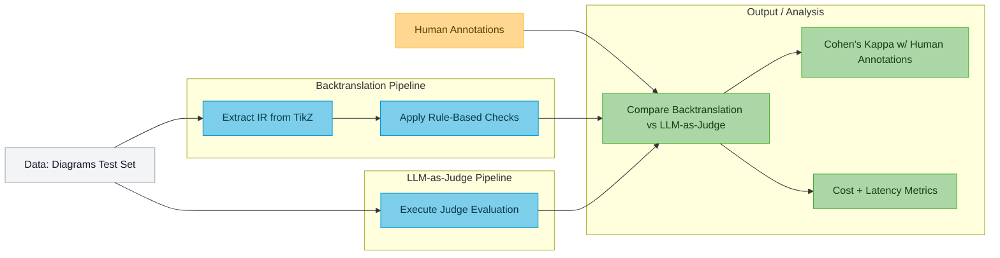

# DiagramIR

Experiment code for **DiagramIR: An Automatic Evaluation Pipeline for Educational Math Diagrams**.
ArXiv: https://arxiv.org/abs/2511.08283

DiagramIR is a scalable and reliable method for automatic evaluation of geometric figures. It uses a language model to translate diagram code into an *intermediate representation (IR)*, a standardized, structured format where rule-based checks can be applied against the key geometric and mathematical constraints of the figure.
This approach achieves higher agreement with human raters (Cohen’s K) and enables smaller models, such as GPT-4.1 Mini, to perform on par with larger frontier models like GPT-5—at nearly 10x lower inference cost.



## Requirements

- **ImageMagick** (`magick` CLI)
- **TeX distribution** with `lualatex` and `dvisvgm`
- Optional: [uv](https://docs.astral.sh/uv/) for environment management.

Verify the system tools are on your `PATH`:

```bash
magick -version
lualatex --version
dvisvgm --version
```

The TeX compilation step also expects the supporting styles in `styles/`
(`IM.cls`, `IMlongdivision.sty`, `Tikz-IM.sty`, `Tikz-IM-ES.sty`).

## Setup

### Python Environment

Create the virtual environment and install the project plus notebook extras:

```bash
uv venv
uv sync --extra notebooks
source .venv/bin/activate
```

### Environment Variables

Copy the example file and populate your API keys / configuration:

```bash
cp .env.example .env
```

Required entries:

- `OPENAI_API_KEY`, `OPENAI_MODEL`
- `TORCH_DEVICE`, `MAX_CONCURRENCY`

## Repository Layout

- Core modules:
  - `backtranslation.py` – TikZ -> IR step.
  - `evaluator.py` – Rule-based checks applied against the IR.
  - `llm_judge.py` – LLM-as-Judge evaluation functions.
- `utils/` –  Schemas, geometry utilities, model wrappers, and judge prompts.
- `scripts/` – Utilities for for LLM-as-a-judge.
- `notebooks/`
- `data/` – Test set and ground truth human annotation CSVs.
- `results/`

## Usage

### Backtranslation Workflow

- Run `notebooks/backtranslation_evaluation.ipynb` to generate model IR extractions and populate `results/backtranslation/`.

### LLM-as-Judge Workflow

- Run `notebooks/llm_judge_evaluation.ipynb`

### Analysis

- Run `notebooks/backtranslation_analysis.ipynb` to compare eval approaches and compute agreement, cost, and timing metrics.
